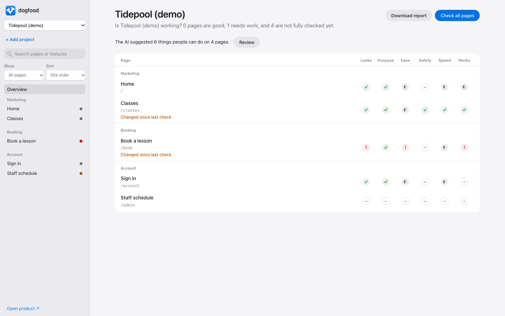

<p align="center"></p>

<h1 align="center">dogfood</h1>

<p align="center">An AI QA system. A local workspace that lists every page of a product, the criteria each page must meet, the evidence you have, and what is still unproven.</p>

<picture>
  <source media="(prefers-color-scheme: dark)" srcset="docs/screenshot-dark.png">
  
</picture>

## Why

"Did we QA it?" usually means someone clicked around. dogfood makes the answer specific, page by page:

- **Every page, one status.** The sidebar lists each page with a status dot: untested, in review, passed, needs work, or blocked.
- **Criteria, not vibes.** Each page carries its features, five quality questions (functionality, speed, design fit, excess, clarity), and security, scraping, and search checklists. A verdict of Pass or Needs work requires a written evidence note.
- **Real evidence.** A full-page screenshot per page, focused test runs from your own repo, and an optional AI read of the screenshot.
- **Honest gaps.** Each page states what remains untested. Passing tests never become an overall score, and an AI rating never changes a verdict.

## Try the demo

Requires Node 20 or newer. There are no dependencies to install.

```sh
git clone https://github.com/ali-abassi/dogfood.git
cd dogfood
npm run demo
```

Open <http://127.0.0.1:4321>. The demo is **Tidepool**, a fictional swim school whose five pages show every state, including two real layout issues on the booking page.

## Use it on your project

Add a project from the app's **Add project** form, the CLI, or an MCP call:

```sh
npm run onboard -- https://site.example
```

Onboarding finds same-site pages from rendered links and `/sitemap.xml`, registers them, and records a validated full-page desktop and mobile screenshot plus measured page facts. It can scan up to 50 pages. Install the browser once with `npm i -g agent-browser`. To scan signed-in pages, pass a Chrome profile such as `Default` with `npm run onboard -- https://site.example --profile Default` or the `browserProfile` field in the app or MCP tool. Add `--ai-review` (the Add project checkbox, or `confirmAiReviewUsage` in `dogfood_onboard_project`) to also run the AI review on every page so each arrives with suggested features; it costs about half a cent per page. Rescan every page with the overview's **Scan all pages** button, `npm run scan -- <project-id>`, or `dogfood_scan_project`; each reports which pages changed visually since the previous scan. A page counts as changed when its screenshot size changed or more than 0.5% of pixels differ (`changeThreshold` in `lib/diff.mjs`). Reviewed pages that changed are marked "Changed since review" so their verdicts get another look; list page IDs to scan only those pages.

`npm run report -- <project-id> > report.md` writes a shareable Markdown summary: what needs attention first, each page's remaining gaps, open issues, and what the evidence does not prove.

Advanced: you can still create `data/projects/<id>.json` by hand using [`demo/projects/tidepool.json`](demo/projects/tidepool.json) as a manifest example, then validate it with `node scripts/check-projects.mjs`.

`data/` is git-ignored, so your projects, screenshots, runs, and reviews stay on your machine. Set `DOGFOOD_DATA` to keep them elsewhere, and `DOGFOOD_PORT` to change the port.

### Focused test runs

List a page's test files under `qa.tests` in the manifest, and point `source.checkout` at your repository. **Run checks** then runs only those files with your project's installed Vitest (`node_modules/.bin/vitest`, `src/**/*.test.ts(x)`) and stores each report under `data/runs/`.

### AI screenshot review

**See page → Ask AI to review image** sends the saved desktop and mobile screenshots to Gemini 3.8 Flash through OpenRouter and saves a page description, a provisional 1–10 clarity estimate, reasons, suggestions, and suggested features you can add to the page in one click. Set `OPENROUTER_API_KEY` in the server's environment. Each review costs a small amount of provider usage and is tied to both screenshots' hashes, so it is marked stale when either screenshot changes.

### Agents (MCP)

Run `node mcp.mjs` as a dependency-free stdio MCP server so an agent can onboard projects, collect QA evidence, run focused tests, and see exactly what remains before completion. Register it with Claude Code using `claude mcp add --scope user dogfood -- node /absolute/path/to/dogfood/mcp.mjs`.

Page-writing tools return that page's status, completion state, and remaining requirements, each naming the tool that resolves it; issue creation also returns the new issue ID. Project creation returns a compact project summary.

- `dogfood_projects` — list projects and completed page counts.
- `dogfood_report` — a Markdown QA report: what needs attention, every page's gaps, open issues, and what is not proven.
- `dogfood_remove_page` — remove a page registered by mistake, with a reason kept on record.
- `dogfood_onboard_project` — find and scan every same-site page from one URL.
- `dogfood_scan_page` — rescan a registered page at desktop and mobile sizes.
- `dogfood_scan_project` — rescan every page of a project and list which pages changed visually since the previous scan.
- `dogfood_create_project` — create a project with its URL, environment, checkout, and guidelines.
- `dogfood_register_page` — register a page, its features, tests, and untested boundary.
- `dogfood_add_features` — add features to a page, for example ones the AI review suggested; names already listed are skipped.
- `dogfood_page` — read a page and its derived QA progress.
- `dogfood_next` — list incomplete pages in site order with missing evidence.
- `dogfood_record_capture` — attach a validated full-page PNG or record a capture blocker; prefer `dogfood_scan_page` for both devices and measured facts.
- `dogfood_record_verdicts` — record partial feature, quality, and checklist verdicts with evidence.
- `dogfood_set_connections` — map the page request and its API/data exchanges.
- `dogfood_set_checklist` — edit checklist questions while preserving connections.
- `dogfood_add_issue` — record a reproducible issue and optional capture evidence.
- `dogfood_resolve_issue` — resolve an issue with retest evidence.
- `dogfood_run_tests` — run the page's configured focused tests.
- `dogfood_ai_review` — request a screenshot review after confirming provider usage.
- `dogfood_complete` — check every applicable completion requirement.

A page is not complete until `dogfood_complete` accepts it; agents must call it before reporting page QA as done.

## How it works

- `server.mjs` is a dependency-free Node server bound to `127.0.0.1`. It rejects cross-origin writes and serves the app and its API.
- `lib/` holds everything the server and agents share: `schema.mjs` (the manifest vocabulary), `store.mjs` (every validated read and write), `completion.mjs` (when a page's QA is complete), `capture.mjs` (screenshot validity), `scans.mjs` (validating measured facts), `scanner.mjs`, `discover.mjs`, and `onboard.mjs` (the browser side of scanning and onboarding), `test-runs.mjs`, and `visual-review.mjs`.
- `public/` is the interface: plain HTML, CSS, and ES modules under `public/js/` with light and dark themes.
- `npm test` runs the store, server, and review tests; `npm run check` validates syntax and the demo manifest.

### When is a page's QA complete?

A page is complete only when every applicable requirement has evidence: validated full-page desktop and mobile screenshots, a scan that matches them, a verdict for every listed feature, all five quality questions, the security, copying, search, and accessibility checklists, at least one mapped connection, passing focused tests (when the page has any), an AI review of the current desktop screenshot, and no open P0 or P1 issue. Problems a scan measures (uncaught errors, failed requests, sideways scrolling) mark the page as needing work. A page passes only when its QA is complete and every verdict is Pass.

## Development

- `npm test` runs the unit tests; `npm run check` validates syntax and the demo manifest; `npm run lint` keeps every function at cyclomatic complexity 5 or less.
- `npm run test:acceptance` runs the end-to-end suites in `tests/acceptance/`. All but the MCP suite drive a real headless browser, so they need agent-browser.
- CI runs the unit tests, the checks, lint, and the MCP suite on every push.

## License

[MIT](LICENSE)
