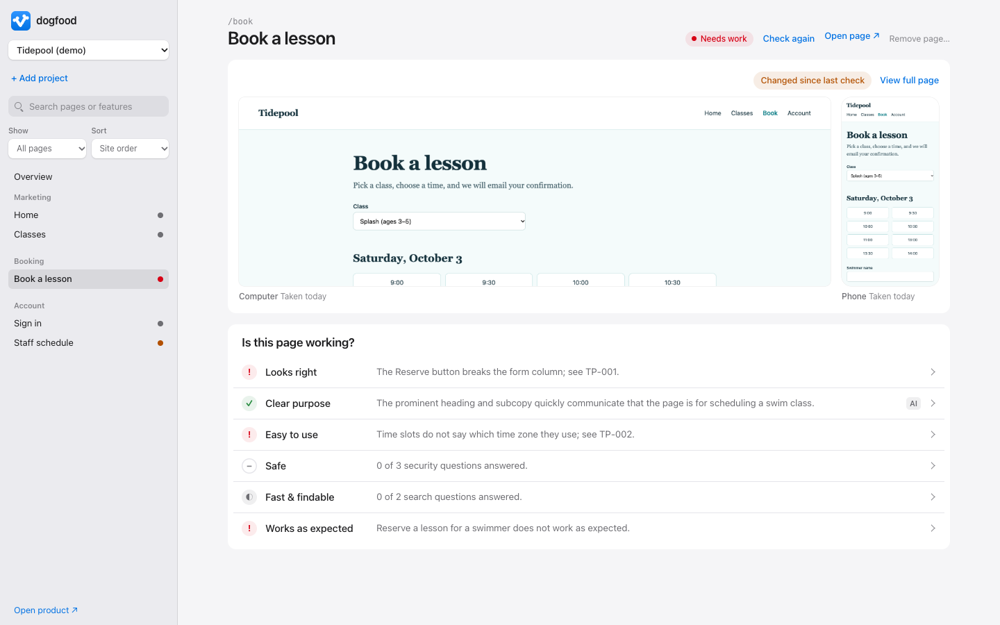

<p align="center"></p>

<h1 align="center">dogfood</h1>

<p align="center"><strong>Is your app working?</strong> dogfood checks every page of your app on a computer and a phone, and gives each page six plain answers, each backed by evidence you can open.</p>

<picture>
  <source media="(prefers-color-scheme: dark)" srcset="docs/screenshot-dark.png">
  
</picture>

## Six answers for every page

| | The question | How it is answered |
|---|---|---|
| **Looks right** | Does it look finished and match the rest of the app? | An AI check of both screenshots against your design rules, or your own verdict |
| **Clear purpose** | Is it clear why this page exists? | The AI check, or your verdict |
| **Easy to use** | Can people find and do things easily, on a phone and a computer? | The AI check or your verdict, measured sideways scrolling and unnamed buttons, and accessibility questions |
| **Safe** | Is it protected from hackers and from people copying its data? | Security and scraping questions answered from the code |
| **Fast & findable** | Does it load quickly and show up properly in search? | Measured load time and search questions |
| **Works as expected** | Does everything you can do here work, with no bugs? | Someone tries each thing a person can do there; open bugs and errors the page check found |

Each answer is **Good**, **Needs work**, **Partly checked**, or **Not checked**, and opens to show where it came from: you, a named agent, the AI, or a measurement. A person's or agent's verdict outranks the AI's, every Good or Needs work carries a note saying what was seen, and nothing unproven is shown as good.

## With your coding agent

Give your agent (Claude Code, Codex, Cursor, or any agent that can run a shell) this sentence:

> Set up dogfood from https://github.com/ali-abassi/dogfood and follow its skills/dogfood/SKILL.md to check every page of my app.

The [skill](skills/dogfood/SKILL.md) walks it through setting dogfood up, adding your app, writing down what people can do on each page, trying each one in a real browser, answering the six questions, and reporting back in plain words. You then open the app to see the result.

## Try the demo

Requires Node 20 or newer. There are no dependencies to install.

```sh
git clone https://github.com/ali-abassi/dogfood.git
cd dogfood
npm run demo
```

Open <http://127.0.0.1:4321>. The demo is **Tidepool**, a fictional swim school whose five pages show every state. Open a page to see its screenshots and six answers:



## Use it yourself

Add your app from the app's **Add an app** form, the CLI, or an MCP call:

```sh
npm run onboard -- https://site.example
```

Onboarding finds same-site pages from rendered links and `/sitemap.xml`, registers them, and records a validated full-page desktop and mobile screenshot plus measured page facts. It can scan up to 50 pages. Install the browser once with `npm i -g agent-browser`. To scan signed-in pages, pass a Chrome profile such as `Default` with `npm run onboard -- https://site.example --profile Default` or the `browserProfile` field in the app or MCP tool. Add `--ai-review` (the checkbox in the app, or `confirmAiReviewUsage` in `dogfood_onboard_project`) to also run the AI check on every page, so each arrives with answers for Looks right, Clear purpose, and Easy to use, and suggestions for what people can do there; it costs about half a cent per page. Check every page again after a deploy with the overview's **Check all pages** button, `npm run scan -- <project-id>`, or `dogfood_scan_project`; each reports which pages look different since the previous check. A page counts as changed when its screenshot size changed or more than 0.5% of pixels differ (`changeThreshold` in `lib/diff.mjs`). Answered pages that changed are marked "Changed since last check" so their answers get another look; list page IDs to check only those pages.

`npm run report -- <project-id> > report.md` writes a shareable Markdown summary: what needs work first, every page's six answers, open bugs, and what the evidence does not prove.

Upgrading from an earlier dogfood? Run `npm run migrate` once. It moves projects to the six answers, keeps old verdicts that no longer count on record under `retiredChecks`, and leaves any outside-edit warning in place.

Advanced: you can still create `data/projects/<id>.json` by hand using [`demo/projects/tidepool.json`](demo/projects/tidepool.json) as a manifest example, then validate it with `node scripts/check-projects.mjs`.

`data/` is git-ignored, so your projects, screenshots, runs, and reviews stay on your machine. Set `DOGFOOD_DATA` to keep them elsewhere, and `DOGFOOD_PORT` to change the port.

### Automated tests

List a page's test files under `qa.tests` in the manifest, and point `source.checkout` at your repository. **Works as expected → Run tests** then runs only those files with your project's installed Vitest (`node_modules/.bin/vitest`, `src/**/*.test.ts(x)`), stores each report under `data/runs/`, and counts the result in the answer.

### The AI check

**Check with AI** on a page sends its computer and phone screenshots, with your project's design rules, to Gemini 3.8 Flash through OpenRouter. It scores Looks right, Clear purpose, and Easy to use from 1 to 10 with a reason each; 7 or above reads as Good, because below 7 the prompt means a visitor must guess or the page looks broken. It also suggests what people can do on the page, which you can add with one click. Set `OPENROUTER_API_KEY` in the server's environment. Each check costs about half a cent and is tied to both screenshots' hashes, so it stops counting when either screenshot changes.

### Agents (MCP)

Run `node mcp.mjs` as a dependency-free stdio MCP server so an agent can add apps, collect evidence, run tests, and see exactly what remains before a page is done. Register it with Claude Code using `claude mcp add --scope user dogfood -- node /absolute/path/to/dogfood/mcp.mjs`. An agent whose client has not loaded it yet can call any tool once from a shell: `node mcp.mjs dogfood_next '{"project":"my-app"}'`.

Page-writing tools return that page's status, its six answers, and what it still needs, each naming the tool that resolves it; issue creation also returns the new issue ID. Project creation returns a compact project summary.

- `dogfood_projects` — list projects and completed page counts.
- `dogfood_report` — a Markdown QA report: what needs attention, every page's gaps, open issues, and what is not proven.
- `dogfood_remove_page` — remove a page registered by mistake, with a reason kept on record.
- `dogfood_onboard_project` — find and scan every same-site page from one URL.
- `dogfood_scan_page` — rescan a registered page at desktop and mobile sizes.
- `dogfood_scan_project` — rescan every page of a project and list which pages changed visually since the previous scan.
- `dogfood_create_project` — create a project with its URL, environment, checkout, and guidelines.
- `dogfood_register_page` — register a page, its features, tests, and untested boundary.
- `dogfood_add_features` — add features to a page, for example ones the AI review suggested; names already listed are skipped.
- `dogfood_page` — read a page and its derived QA progress.
- `dogfood_next` — list incomplete pages in site order with missing evidence.
- `dogfood_record_capture` — attach a validated full-page PNG or record a capture blocker; prefer `dogfood_scan_page` for both devices and measured facts.
- `dogfood_record_verdicts` — record partial verdicts with evidence: `checks` (design, purpose, ease), `features`, and checklist questions (`audit`).
- `dogfood_set_connections` — map the page request and its API/data exchanges.
- `dogfood_set_checklist` — edit checklist questions while preserving connections.
- `dogfood_add_issue` — record a reproducible issue and optional capture evidence.
- `dogfood_resolve_issue` — resolve an issue with retest evidence.
- `dogfood_run_tests` — run the page's configured focused tests.
- `dogfood_ai_review` — run the AI check after confirming provider usage.
- `dogfood_complete` — check that a page's screenshots and page check are current, all six answers are answered, and no blocking bug is open.

A page is not complete until `dogfood_complete` accepts it; agents must call it before reporting page QA as done.

## How it works

- `server.mjs` is a dependency-free Node server bound to `127.0.0.1`. It rejects cross-origin writes and serves the app and its API.
- `lib/` holds everything the server and agents share: `schema.mjs` (the manifest vocabulary), `store.mjs` (every validated read and write), `answers.mjs` (the six answers), `completion.mjs` (when a page's QA is complete), `capture.mjs` (screenshot validity), `scans.mjs` (validating measured facts), `scanner.mjs`, `discover.mjs`, and `onboard.mjs` (the browser side of scanning and onboarding), `test-runs.mjs`, and `visual-review.mjs`.
- `public/` is the interface: plain HTML, CSS, and ES modules under `public/js/` with light and dark themes.
- `skills/dogfood/SKILL.md` is the skill a coding agent follows to check an app with dogfood.

### When is a page done?

A page is done only when its validated full-page computer and phone screenshots are current, a page check matches them, all six answers are answered (Good or Needs work, not Partly checked or Not checked), and no bug that breaks the app or blocks the page is open. A page is **Good** only when it is done and all six answers are Good. Problems the page check measures (crashes and failed requests under Works as expected, sideways scrolling and unnamed buttons under Easy to use, a load over 3 seconds under Fast & findable) make their answer Needs work.

## Development

- `npm test` runs the unit tests; `npm run check` validates syntax and the demo manifest; `npm run lint` keeps every function at cyclomatic complexity 5 or less.
- `npm run test:acceptance` runs the end-to-end suites in `tests/acceptance/`. All but the MCP suite drive a real headless browser, so they need agent-browser. Set `DOGFOOD_RECORD_DIR` to keep a video of the report-card suite, which walks through the whole app the way a person would. CI keeps that video and every suite's result with each run, so anyone can see the checks happen.
- CI runs the unit tests, the checks, lint, and every acceptance suite (in headless Chrome) on every push.

## License

[MIT](LICENSE)
