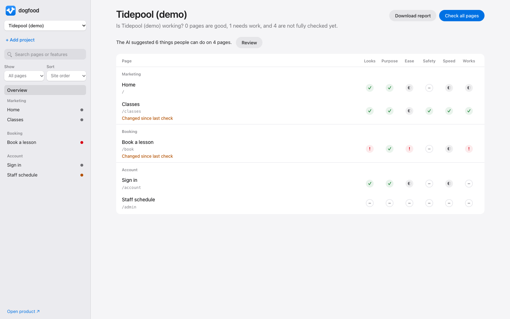
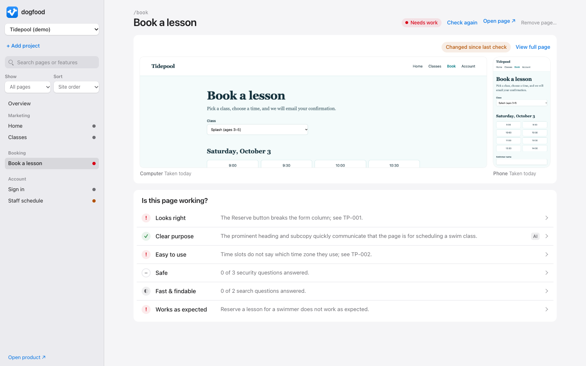

<p align="center"></p>

<h1 align="center">dogfood</h1>

<p align="center"><strong>A lightweight workspace for coding agents to plan, build and prove web projects.</strong> Keep a clear task plan, checks and page evidence in one place; and you see where quality stands, page by page, as the project moves: computer and phone screenshots and six plain answers per page, each backed by evidence you can open. QA becomes a streamlined process, so you finish projects faster.</p>

<picture>
  <source media="(prefers-color-scheme: dark)" srcset="docs/screenshot-dark.png">
  
</picture>

## Plan → build → verify → resume

Install the CLI once with `npm link` from the Dogfood checkout, or invoke `node /absolute/path/to/dogfood/bin/dogfood.mjs` directly. Start a project before a website exists:

```sh
cd /path/to/my-project
dogfood init --checkout . --id my-app --name "My App"
dogfood context --json
```

`init` is idempotent. `doctor` checks the local setup; browser and model usage are optional for planning. Add tasks with a concrete outcome, scope, dependencies and real check commands:

```json
{"id":"booking","title":"Save a booking","outcome":"The saved booking survives reload","scope":["src/booking"],"checks":[{"id":"booking","command":["npm","test"]}]}
```

Save that as `task.json`, then:

```sh
dogfood task add --input task.json --agent codex
dogfood next --json
dogfood task claim booking --agent codex
# Build the task, finish edits/commits, and check the real user outcome.
dogfood verify booking --agent codex
dogfood task accept booking --agent codex
```

Checks run as explicit argument arrays in the registered Git checkout, without shell parsing. Receipts are bound to the plan and current source files; changes during or after verification require a new run. A linked `pageIds` list requires those pages to pass acceptance as well. Unnamed tasks receive stable `task-N` IDs. Dependencies and atomic claims keep agents on available work. Record a blocker or handoff with `task update --input changes.json`; `releaseOwner:true` releases your claim. An abandoned claim can be recovered explicitly with `releaseOwner:true` plus a `recoveryReason`; the recovery is recorded and clears its receipt. Checks can set `timeoutSeconds` (1–1800, default 300), and output is kept as bounded tails rather than stopping a noisy test.

The **Plan** view shows current work, available work, blockers and receipts, with the milestone document folded below. A fresh agent starts with `context --json`; it does not need the earlier chat. Tasks live once in `data/workflows/`; Markdown holds product intent and design rather than a competing status ledger. `--input -` reads JSON from stdin, `schema TOOL` shows the exact contract, and `tool TOOL --input file.json` exposes every underlying MCP operation.

Use `attach-url URL` once the app runs, then register its pages with the existing QA tools. `onboard` creates a new project; do not use it to replace a checkout-first plan.

**Checked and accepted are different.** `dogfood gate` requires every feature/checklist item to have a verdict and a successful current scan. Recorded failures can finish an audit. `dogfood gate --accept` additionally requires six Good answers, no open findings and fresh checkout/environment provenance. Latest failed scans block earlier evidence; backend-only changes invalidate current checkout claims. Older evidence stays readable and must be refreshed before acceptance. A remote URL must explicitly declare `servesCheckout:true` (CLI `attach-url URL --serves-checkout`) to accept checkout-linked evidence; only make that declaration after verifying its build. Loopback is inferred; verify the local server actually runs the registered checkout, especially when multiple worktrees run on different ports. Attach the project URL before page acceptance; page-specific URLs must use that environment's origin. This declaration is not independent deployment proof. Acceptance proves the configured checks and recorded page evidence, not deployment or untested integrations.

## Six answers for every page

| | The question | How it is answered |
|---|---|---|
| **Looks right** | Does it look finished and match the rest of the app? | An AI check of both screenshots against your design rules, or your own verdict |
| **Clear purpose** | Is it clear why this page exists? | The AI check, or your verdict |
| **Easy to use** | Can people find and do things easily, on a phone and a computer? | The AI check or your verdict, measured sideways scrolling and unnamed buttons, and accessibility questions |
| **Safe** | Is it protected from hackers and from people copying its data? | Security and scraping questions answered from the code |
| **Fast & findable** | Does it load quickly and show up properly in search? | Measured load time and search questions |
| **Works as expected** | Does everything you can do here work, with no bugs? | Someone tries each thing a person can do there; open bugs and errors the page check found |

Each answer is **Good**, **Needs work**, **Partly checked**, **Not checked**, **Recheck**, or **Blocked**, and opens to show where it came from: you, a named agent, the AI, or a measurement. A person's or agent's verdict outranks the AI's, every Good or Needs work carries a note saying what was seen, and nothing unproven is shown as good.

Use the sidebar search to find a page by its name, group, route, page ID, something you can do there, or an open bug's ID or title. Words can appear in any order: `invoice download` finds a page with “Download invoice.” Case, extra whitespace and accents don't prevent matches. Every word must match the same page; punctuation stays literal, and resolved bugs are excluded. The selected filter and sort still apply.

## With your coding agent

Give your agent (Claude Code, Codex, Cursor, or any agent that can run a shell) this sentence:

> Set up dogfood from https://github.com/ali-abassi/dogfood and follow its skills/dogfood/SKILL.md to plan, build and verify my project.

The [skill](skills/dogfood/SKILL.md) walks it through setting dogfood up, adding your app, writing down what people can do on each page, trying each one in a real browser, answering the six questions, and reporting back in plain words. You then open the app to see the result.

## Try the demo

Requires Node 20 or newer. There are no dependencies to install.

```sh
git clone https://github.com/ali-abassi/dogfood.git
cd dogfood
npm run demo
```

Open <http://127.0.0.1:4321>. The demo is **Tidepool**, a fictional swim school whose five pages show every state. Open a page to see its screenshots and six answers:



## Use it yourself

Add your app from the app's **Add an app** form, the CLI, or an MCP call:

```sh
npm run onboard -- https://site.example
```

Onboarding finds same-site pages from rendered links and `/sitemap.xml`, registers them, and records a validated full-page desktop and mobile screenshot plus measured page facts. It can scan up to 50 pages. Install the browser once with `npm i -g agent-browser`. To scan signed-in pages, pass a Chrome profile such as `Default` with `npm run onboard -- https://site.example --profile Default` or the `browserProfile` field in the app or MCP tool. Add `--ai-review` (the checkbox in the app, or `confirmAiReviewUsage` in `dogfood_onboard_project`) to also run the AI check on every page, so each arrives with answers for Looks right, Clear purpose, and Easy to use, and suggestions for what people can do there; it costs under a tenth of a cent per page. Check every page again after a deploy with the overview's **Check all pages** button, `npm run scan -- <project-id>`, or `dogfood_scan_project`; each reports which pages look different since the previous check. A page counts as changed when its screenshot size changed or more than 0.5% of pixels differ (`changeThreshold` in `lib/diff.mjs`). Good answers with evidence older than the last visual change read Recheck until they are answered again; list page IDs to check only those pages.

`npm run report -- <project-id> > report.md` writes a shareable Markdown summary: what needs work first, every page's six answers, open bugs, and what the evidence does not prove.

`npm run gate -- <project-id> [page-id ...]` applies the same completion gate as `dogfood_complete` from the command line: it exits 0 only when every named page (or every page) is complete, 1 with each page's missing evidence when one is not, and 2 for an unknown project or page. Other tools can require page QA with it; an agent runner can run it after every worker turn.

Upgrading from an earlier dogfood? Run `npm run migrate` once. It moves projects to the six answers and the current data version, keeps old verdicts that no longer count on record under `retiredChecks`, and leaves any outside-edit warning in place.

Advanced: you can still create `data/projects/<id>.json` by hand using [`demo/projects/tidepool.json`](demo/projects/tidepool.json) as a manifest example, then validate it with `node scripts/check-projects.mjs`.

`data/` is git-ignored, so your projects, screenshots, runs, and reviews stay on your machine. Set `DOGFOOD_DATA` to keep them elsewhere, and `DOGFOOD_PORT` to change the port.

### Automated tests

List a page's test files under `qa.tests` in the manifest, and point `source.checkout` at your repository. **Works as expected → Run tests** then runs only those files with your project's installed Vitest (`node_modules/.bin/vitest`, `src/**/*.test.ts(x)`), stores each report under `data/runs/`, and counts the result in the answer.

### Each page

A page's report shows its full-page computer and phone screenshots in frames you scroll top to bottom. **History** steps back through every day the page was captured (dogfood keeps each replaced screenshot under `data/captures/<project>/history/`; `GET /api/projects/<id>/pages/<page>/history` lists them). **About this page** gives what the page is for (from the AI check), its title and search description, the features on it with their status, every link on it split into this site and elsewhere, and the API calls it makes, from the code map and from the traffic each page check records.

### The QA agent

A page that is not complete offers **Ask the QA agent**. dogfood starts the command in `DOGFOOD_QA_AGENT` (set in the git-ignored `.env`) with a brief naming what the page still needs, how to record evidence through dogfood's tools, and the rules (never publish, pay, delete, change settings, or type a password). While it works the page shows its status and reloads its evidence. For example, `.env` might hold:

```
DOGFOOD_QA_AGENT=my-agent run --name qa-{page}-{run} --cwd {workdir} --background
META_API_KEY=...
```

`{project}`, `{page}`, `{run}` and `{workdir}` are filled in; an agent runner can keep the agent working until `dogfood_complete` accepts the page. When a signed-in page's saved session expires, point the project's scans at a profile that is still signed in with `dogfood_set_browser_profile` rather than typing a password.

### Competitors

Each project keeps up to five competitors. Add one by its website and dogfood reads its key pages as a signed-out visitor (the landing page, then pricing, features, product and about pages before anything else), keeping full-page computer and phone screenshots, each page's title, description and headings, and its text. **Summarize with AI** sends that text (no screenshots) with the project's `vision.md` to DeepSeek (`deepseek-flash`) and records what they do, who it is for, pricing, how they sell, key features, and how they compare with the project. It costs well under a cent. Competitors live in `data/competitors/<project>.json`, and their screenshots under `data/captures/<project>/competitors/`.

### The AI check

**Check with AI** on a page sends its computer and phone screenshots, with your project's design rules, to DeepSeek (`deepseek-flash`, which reads images). It scores Looks right, Clear purpose, and Easy to use from 1 to 10 with a reason each; 7 or above reads as Good, because below 7 the prompt means a visitor must guess or the page looks broken. It also suggests what people can do on the page, which you can add with one click. Put `DEEPSEEK_API_KEY=...` in a `.env` file at dogfood's root (git-ignored) or in the server's environment; the MCP server reads the same file. Each check costs under a tenth of a cent (about $0.0006 for both screenshots), recorded from DeepSeek's token counts and published prices, and is tied to both screenshots' hashes, so it stops counting when either screenshot changes.

### Agents (MCP)

Run `node mcp.mjs` as a dependency-free stdio MCP server so an agent can add apps, collect evidence, run tests, and see exactly what remains before a page is done. Register it with Claude Code using `claude mcp add --scope user dogfood -- node /absolute/path/to/dogfood/mcp.mjs`. An agent whose client has not loaded it yet can call any tool once from a shell: `node mcp.mjs dogfood_next '{"project":"my-app"}'`.

Page-writing tools return that page's status, its six answers, and what it still needs, each naming the tool that resolves it; issue creation also returns the new issue ID. Project creation returns a compact project summary.

- `dogfood_projects` — list projects and completed page counts.
- `dogfood_report` — a Markdown QA report: what needs attention, every page's gaps, open issues, and what is not proven.
- `dogfood_remove_page` — remove a page registered by mistake, with a reason kept on record.
- `dogfood_onboard_project` — find and scan every same-site page from one URL.
- `dogfood_scan_page` — rescan a registered page at desktop and mobile sizes.
- `dogfood_scan_project` — rescan every page of a project and list which pages changed visually since the previous scan.
- `dogfood_create_project` — create a project with its URL, environment, checkout, and guidelines.
- `dogfood_set_browser_profile` — point a project's scans at a Chrome profile that is signed in, when a saved session expired.
- `dogfood_register_page` — register a page, its features, tests, and untested boundary.
- `dogfood_add_features` — add features to a page, for example ones the AI review suggested; names already listed are skipped.
- `dogfood_set_core_features` — set the project's core features (its main capabilities, each mapped to the pages that deliver it); the app's Features tab shows each one with a status rolled up from its pages.

- `dogfood_competitors` — list the project's competitors with their AI summaries, pages, and screenshot files.
- `dogfood_add_competitor` — add a competitor by its website and scan its key pages (at most five per project).
- `dogfood_scan_competitor` — rescan a competitor's key pages.
- `dogfood_summarize_competitor` — have the AI summarize a scanned competitor and compare it with the project's vision.
- `dogfood_record_competitor_summary` — record a summary the agent wrote itself from the scanned pages, at no provider cost.
- `dogfood_page` — read a page and its derived QA progress.
- `dogfood_next` — list incomplete pages in site order with missing evidence.
- `dogfood_record_capture` — attach a validated full-page PNG or record a capture blocker; prefer `dogfood_scan_page` for both devices and measured facts.
- `dogfood_record_verdicts` — record partial verdicts with evidence: `checks` (design, purpose, ease), `features`, and checklist questions (`audit`).
- `dogfood_set_connections` — map the page request and its API/data exchanges.
- `dogfood_set_checklist` — edit checklist questions while preserving connections.
- `dogfood_add_issue` — record a reproducible issue and optional capture evidence.
- `dogfood_resolve_issue` — resolve an issue with retest evidence.
- `dogfood_run_tests` — run the page's configured focused tests.
- `dogfood_ai_review` — run the AI check after confirming provider usage.
- `dogfood_complete` — check that a page's screenshots and page check are current, all six answers are answered, and no blocking bug is open.

A page is not complete until `dogfood_complete` confirms the audit is complete; agents must call it before reporting the audit as done. Use `dogfood_accept_page` or `dogfood gate --accept` before reporting acceptance.

Each project's Docs view shows `vision.md`, `design.html` (the brand guide) and `plan.md` from its current working checkout. Generate a brand guide from a project's `design.json` and logo with `python3 scripts/brand-guide.py design.json logo.svg design.html "Name" "One-line promise"`.

## How it works

- `server.mjs` is a dependency-free Node server bound to `127.0.0.1`. It rejects cross-origin writes and serves the app and its API.
- `lib/` holds everything the server and agents share: `schema.mjs` (the manifest vocabulary), `store.mjs` (every validated read and write), `answers.mjs` (the six answers), `completion.mjs` (when a page's QA is complete), `capture.mjs` (screenshot validity), `scans.mjs` (validating measured facts), `scanner.mjs`, `discover.mjs`, and `onboard.mjs` (the browser side of scanning and onboarding), `test-runs.mjs`, and `visual-review.mjs`.
- `public/` is the interface: plain HTML, CSS, and ES modules under `public/js/` with light and dark themes.
- `skills/dogfood/SKILL.md` is the skill a coding agent follows to check an app with dogfood.

### When is a page done?

A page is done only when its validated full-page computer and phone screenshots are current, a page check matches them, all required feature/checklist rows and six answers are answered (Good or Needs work, not Partly checked, Recheck or Not checked), and no bug that breaks the app or blocks the page is open. A page is **Good** only when it is done and all six answers are Good. Problems the page check measures (crashes and failed requests under Works as expected, sideways scrolling and unnamed buttons under Easy to use, a load over 3 seconds under Fast & findable) make their answer Needs work.

## Development

- `npm test` runs the unit tests; `npm run check` validates syntax and the demo manifest; `npm run lint` keeps every function at cyclomatic complexity 5 or less.
- `npm run test:acceptance` runs the end-to-end suites in `tests/acceptance/`. All but the MCP suite drive a real headless browser, so they need agent-browser. Set `DOGFOOD_RECORD_DIR` to keep a video of the report-card suite, which walks through the whole app the way a person would. CI keeps that video and every suite's result with each run, so anyone can see the checks happen.
- CI runs the unit tests, the checks, lint, and every acceptance suite (in headless Chrome) on every push.

## License

[MIT](LICENSE)
